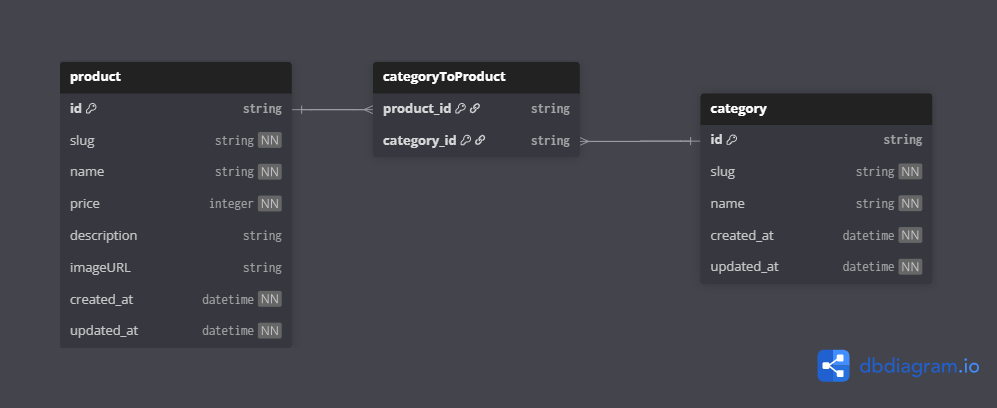

# Flozka

[Flozka](https://flozka.com) online store for floral products.

## Links

- Website/Frontend: <https://flozka.com>
  - Backend: <https://api.flozka.com>
- Repositories:
  - General: <https://github.com/siabillalquba/flozka>
  - Backend API: <https://github.com/siabillalquba/flozka-api>
  - Frontend Web: <https://github.com/siabillalquba/flozka-web>

Inspirations:

- <https://www.bloomon.co.uk/>
- <https://www.baletonflowerchef.com/>

## Architecture & Tech Stack

### Client = Presentation Layer (UI)

- HTML
- CSS
  - Tailwind CSS
  - shadcn/ui
- JavaScript
- TypeScript
- React
- React Router
- Docker

### Server = Application Layer (Business Logic)

- JavaScript
- TypeScript
- Hono
- OpenAPI
- Zod
- Docker

### Data Access Layer (Database)

- Prisma
- PostgreSQL
- Docker

## Features

- Home page
  - Hero section
  - Products catalogue.
- Product page
  - Image
  - SKU (stock keeping unit)
  - Name
  - Price
  - Description
  - Add to cart form: quantity input & add to cart button
- Shopping cart page
  - Product items to buy
    - Image, name, price, quantity, total (price x quantity)
    - Remove item
  - Link: continue shopping, go to products catalogue
  - Link: checkout
- Checkout page
  - Order summary
    - Product items to buy
    - Grand total of all product items to buy
- Place order / transaction is being processed

## UI Designs

- Figma: <https://www.figma.com/design/4ZNR6gvcsBGU308MnoxoJo/Flozka?node-id=0-1&t=Aw7SQdnE9eNPE28V-1>

### Home Page


## Entity Relationship Diagram (ERD)



## REST API Endpoints

- Production: `https://flozka.com`
- Local: `http://localhost:3000`

| Endpoint         | HTTP     | Description               |
| ---------------- | -------- | ------------------------- |
| `/products`      | `GET`    | Get all products          |
| `/products/:id`  | `GET`    | Get product by id         |
| `/products/seed` | `POST`   | Seed all initial products |
| `/products`      | `POST`   | Add new product           |
| `/products`      | `DELETE` | Delete all products       |
| `/products/:id`  | `DELETE` | Delete product by id      |
| `/products/:id`  | `PUT`    | Update product by id      |

### Product

```json
{
  "id": "abc123",
  "slug": "fresh-flower",
  "name": "Fresh Flower",
  "price": 120000
}
```

### Add New Product

Request Body:

```json
{
  "name": "Fresh Flower",
  "price": 120000,
  "color": "white"
}
```

Response Body:

```json
{
  "id": "abc123",
  "name": "Fresh Flower",
  "price": 120000,
  "color": "white"
}
```
